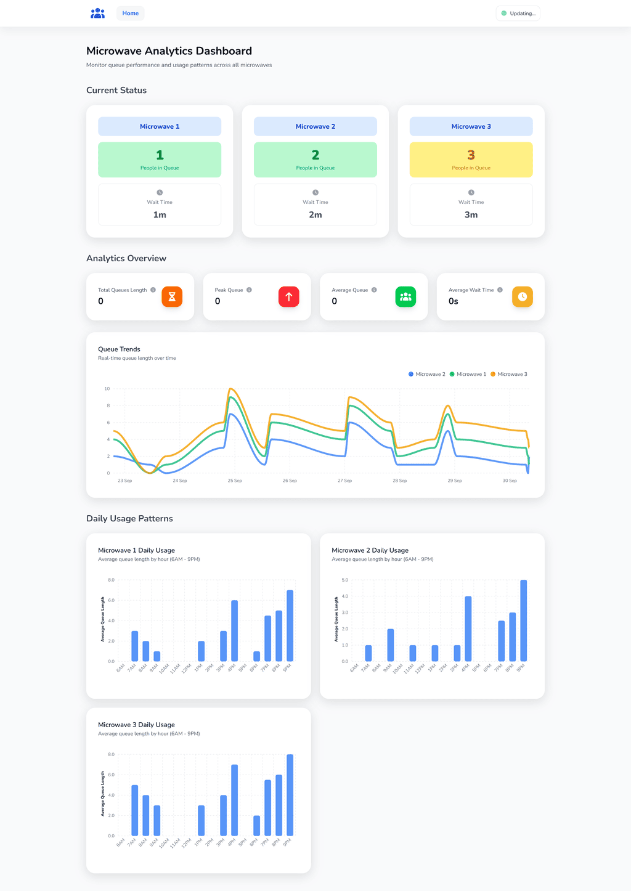
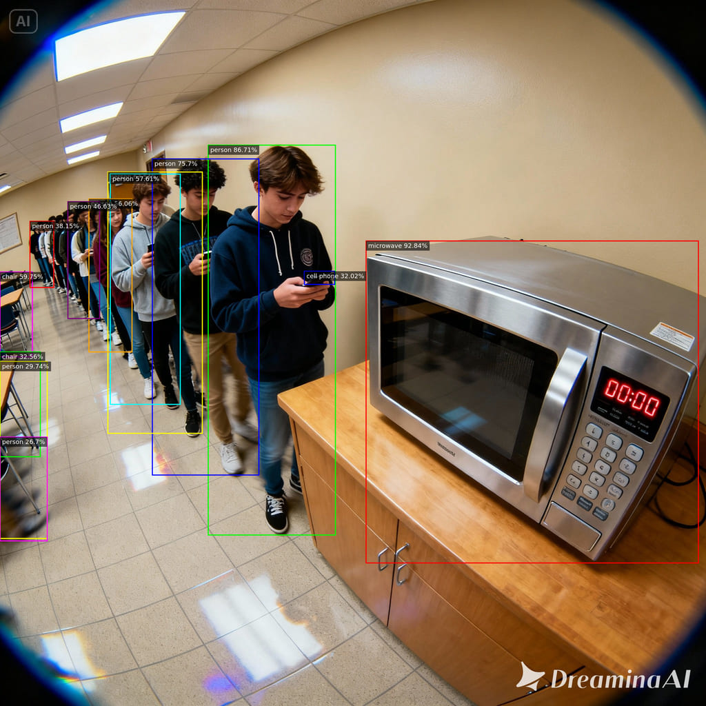
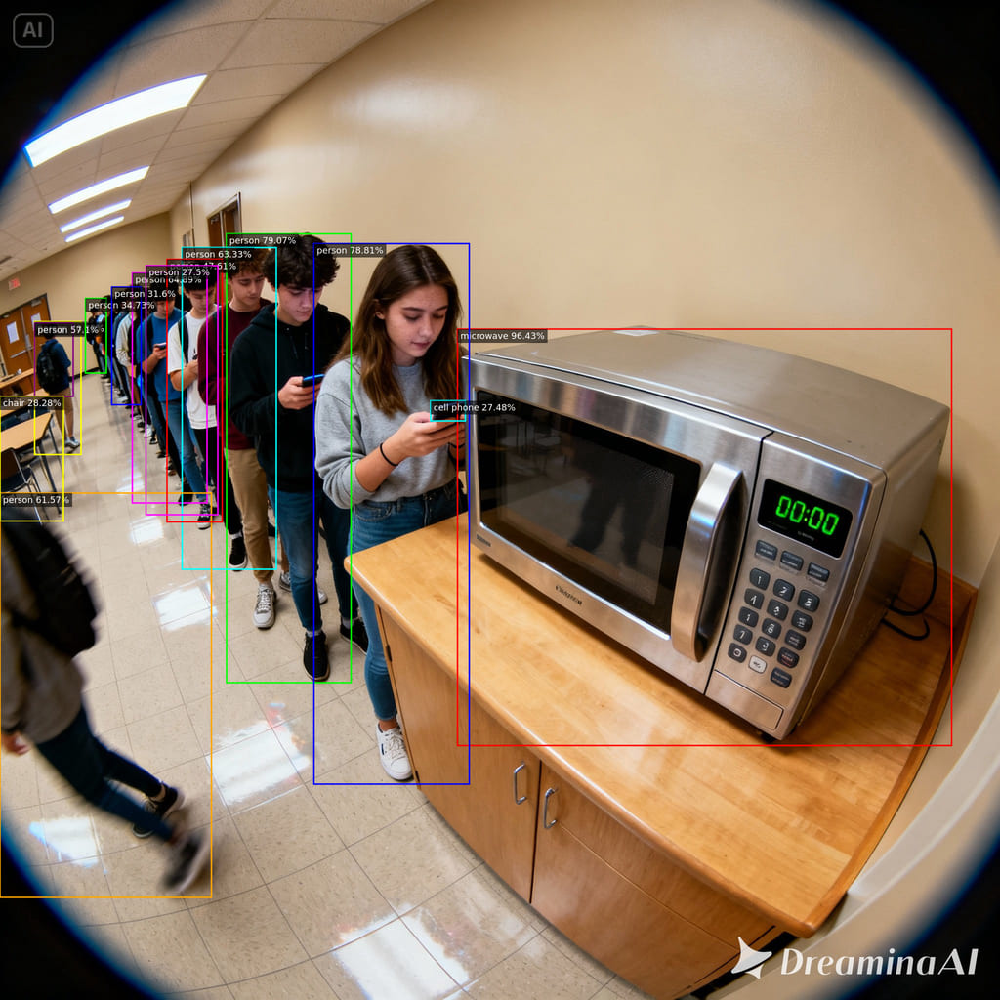
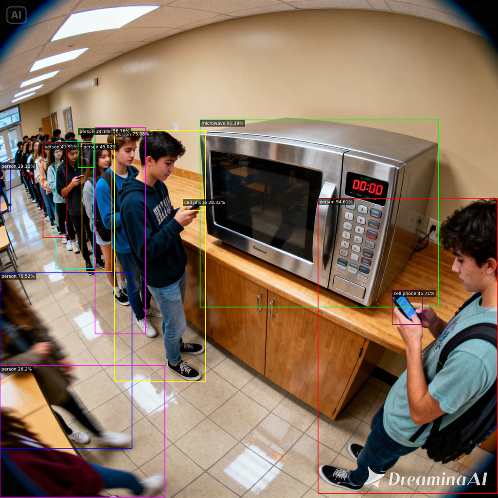
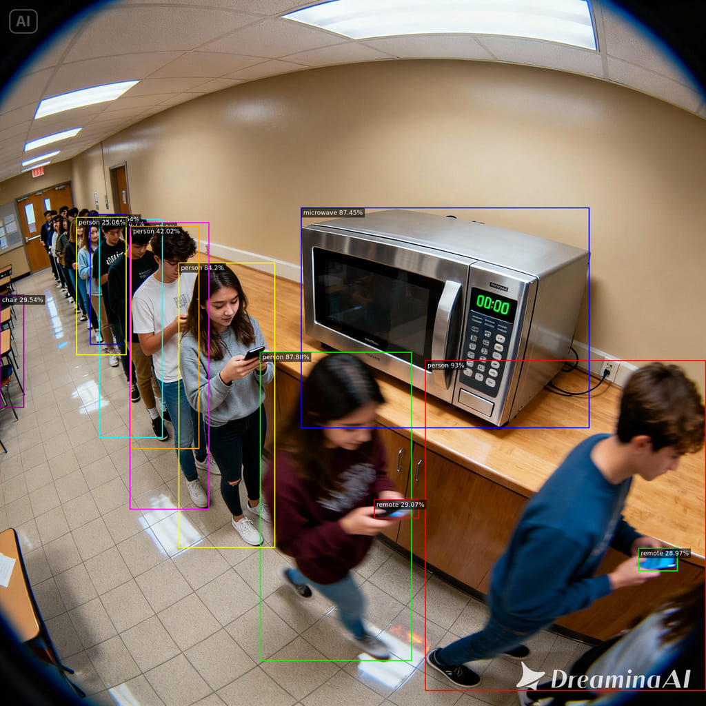

# 🍜 MicroW8 - Smart Microwave Queue Analytics

<div align="center">


</div>

---

## 🎯 What is MicroW8?

MicroW8 is an intelligent **microwave queue monitoring system** designed for university campuses and busy facilities. Using cutting-edge **computer vision** and **real-time analytics**, it automatically counts people waiting at microwave stations and provides comprehensive insights through a beautiful web dashboard.

### 🌟 Key Highlights

- 🤖 **AI-Powered Detection**: Uses YOLO11n for accurate person detection
- 📊 **Real-Time Analytics**: Live queue monitoring with historical trends
- 🎨 **Modern Dashboard**: Sleek Nuxt 3 interface with interactive charts
- 📱 **Responsive Design**: Works perfectly on desktop and mobile
- 🔄 **Automated Polling**: Continuous monitoring with configurable intervals
- 📈 **Rich Analytics**: Daily usage patterns, queue statistics, and performance metrics
- 🛡️ **Privacy-First**: Runs entirely on Raspberry Pi for complete data control and privacy

---

## 📸 Screenshots

<div align="center">

### 📱 Dashboard Screenshot


### 🤖 AI Queue Detection Examples

<table>
	<tr>
		<td align="center">
			
			<br><em>Example 1</em>
		</td>
		<td align="center">
			
			<br><em>Example 2</em>
		</td>
	</tr>
	<tr>
		<td align="center">
			
			<br><em>Example 3</em>
		</td>
		<td align="center">
			
			<br><em>Example 4</em>
		</td>
	</tr>
</table>

</div>

---

## 🏗️ Architecture

MicroW8 consists of four main components:

### 📹 Cameras (ESP32-CAM)
- IoT camera modules for on-demand image capture
- Triggered via HTTP requests to capture JPEG images

### 🐍 Inference Server (FastAPI)
- Python-based AI service using YOLO11n for person detection
- Processes images and returns queue count data

### 🗄️ Database (MySQL)
- Relational database for storing queue analytics and historical data
- Uses Knex.js for SQL query building

### 🎨 Dashboard (Nuxt 3)
- Full-stack Vue.js web application
- Real-time analytics and visualization interface

### 🔄 Data Flow

1. **📹 Camera Capture**: ESP32-CAM modules capture images on-demand via HTTP requests
2. **🔍 Image Processing**: Nuxt server processes JPEG images from camera responses
3. **🤖 AI Detection**: Images sent to Python inference server for person counting
4. **💾 Data Storage**: Queue counts stored in MySQL with timestamps
5. **📊 Visualization**: Real-time dashboard displays analytics and trends

---

## 🛠️ Tech Stack

### 🎨 Frontend (Dashboard)
- **Nuxt 3** - Full-stack Vue.js framework
- **Vue 3** - Progressive JavaScript framework
- **Tailwind CSS** - Utility-first CSS framework
- **ApexCharts** - Interactive charting library
- **FontAwesome** - Icon library
- **Jimp** - Image processing library

### 🐍 Backend (Inference)
- **FastAPI** - Modern Python web framework
- **Ultralytics YOLO** - State-of-the-art object detection
- **OpenCV** - Computer vision library
- **Uvicorn** - ASGI web server

### 🗄️ Database
- **MySQL** - Relational database
- **Knex.js** - SQL query builder

### 🔧 Infrastructure
- **PM2** - Process manager for Node.js/Python apps
- **ESP32-CAM** - IoT camera modules for on-demand image capture

---

## 📋 Features

### 🎯 Core Functionality
- ✅ **Real-time Queue Monitoring** - Live person counting at microwave stations
- ✅ **Automated Data Collection** - Periodic image capture from camera modules
- ✅ **Historical Analytics** - 30+ days of queue data analysis
- ✅ **Multi-Microwave Support** - Monitor multiple microwave locations
- ✅ **Configurable Detection** - Adjustable confidence thresholds

### 📊 Analytics & Insights
- 📈 **Queue History Charts** - Time-series visualization of queue trends
- 📊 **Daily Usage Patterns** - Hourly averages from 6AM to 9PM
- 📋 **Queue Statistics** - Average, maximum, and total queue metrics
- ⏱️ **Wait Time Estimation** - Calculated wait times based on queue length
- 🎨 **Color-coded Status** - Visual indicators for queue severity

### 🎨 User Experience
- 🌙 **Responsive Design** - Optimized for all screen sizes
- 🎭 **Smooth Animations** - AOS (Animate On Scroll) integration
- 🎨 **Modern UI** - Clean, professional interface
- 📱 **Mobile Friendly** - Touch-optimized controls
- 🔄 **Real-time Updates** - Live data refresh

---

## 🚀 Quick Start

### 📋 Prerequisites

- �️ **Local MySQL**
- 🐍 **Python 3.12+**
- 🟢 **Node.js 18+**
- 📹 **ESP32-CAM modules**

### 🥧 Raspberry Pi Deployment

For enhanced **privacy and data control**, the entire system can run on a **Raspberry Pi**:

- 🔒 **Complete Data Sovereignty**: All processing happens locally on your device
- ☁️ **No Cloud Dependencies**: No external services or data transmission
- 💰 **Cost Effective**: Low-power, always-on monitoring solution
- ⚡ **Easy Setup**: Simple deployment on Raspberry Pi 4/5

**Recommended Setup**: Raspberry Pi 4 with 4GB RAM + ESP32-CAM modules

### 🔧 Configuration

#### Frontend (.env)
```env
# Application Environment
NUXT_ENVIRONMENT=development  # Environment mode (development/production)

# Inference Server Configuration
INFERENCE_SERVER_URL=http://localhost:3002  # URL where the Python inference server is running

# Camera Polling
POLLING_INTERVAL=60  # How often to poll cameras for new images (in seconds)

# Camera Configuration (JSON array of camera objects)
CAMERAS=[{"microwaveId":"550e8400-e29b-41d4-a716-446655440001","url":"http://192.168.21.112"}]

# MySQL Database Configuration
MYSQL_IP=127.0.0.1      # MySQL server IP address
MYSQL_PORT=3306         # MySQL server port
MYSQL_USER=root         # MySQL username
MYSQL_PASSWORD=password # MySQL password
MYSQL_DATABASE=microw8  # MySQL database name
```

#### Inference Server
The Python inference server uses hardcoded configuration values and does not require environment variables. It automatically loads the YOLO model from `models/yolo11n.pt` and uses a default confidence threshold of 0.25.

#### ESP32-CAM Configuration
The ESP32-CAM modules use a configuration file stored in the SPIFFS filesystem. Edit the `esp-cam/data/config.txt` file with your WiFi credentials and settings:

```plaintext
SSID=Your_WiFi_Network_Name
PASSWORD=Your_WiFi_Password
SERIAL=true
```

- **SSID**: Your WiFi network name
- **PASSWORD**: Your WiFi network password
- **SERIAL**: Enable/disable serial debugging (true/false)

Note that you need to manually create and upload the SPIFFS filesystem image before uploading the firmware.

## 🎯 Usage

### 👀 Monitoring Dashboard

1. **Current Status** - View live queue counts for all microwaves
2. **Analytics Overview** - Check today's statistics and trends
3. **Daily Patterns** - Analyze usage patterns throughout the day
4. **Historical Data** - Review past performance and queue trends

### 🤖 AI Detection

The system automatically:
- 📹 Triggers image capture from ESP32-CAM modules via HTTP requests
- 🔍 Detects people using YOLO object detection
- 📊 Counts queue lengths in real-time
- 💾 Stores data for analytics and reporting

### 📊 Analytics Insights

- **Queue Statistics**: Average, maximum, and total daily queues
- **Wait Time Estimation**: Calculated based on queue length
- **Usage Patterns**: Hourly averages showing peak times
- **Trend Analysis**: Historical queue data visualization

---

## 📄 License

This project is licensed under the **MIT License** - see the [LICENSE](LICENSE) file for details.

---

## 🙏 Acknowledgments

- 🎯 **Ultralytics** for the amazing YOLO implementation
- 🎨 **Nuxt Team** for the fantastic framework
- 📊 **ApexCharts** for beautiful data visualization
- 🤖 **FastAPI** for the lightning-fast Python API